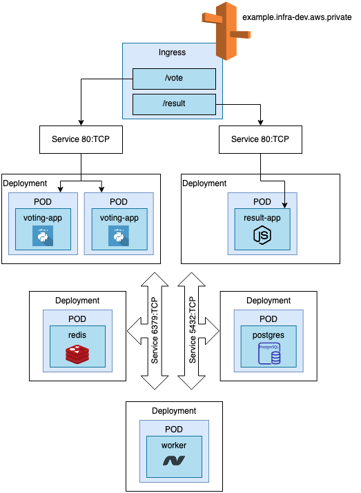
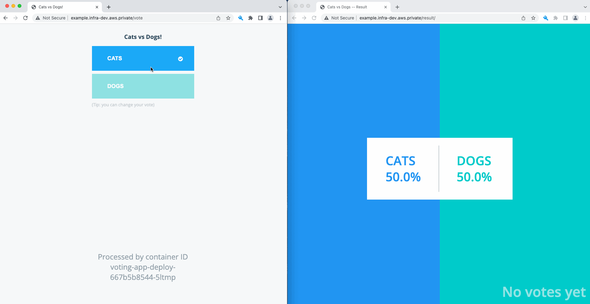

Voting App
=========

A distributed application running in Kubernetes, providing two interfaces, one for voting one for seeing the results.

This is based on the original [example-voting-app](https://github.com/dockersamples/example-voting-app) repository.

Architecture
-----

<p align="center">
  
</p>

* A front-end web app in [Python](/docker/vote) which lets you vote between two options
* A [Redis](https://hub.docker.com/_/redis/) queue which collects new votes
* A [Java](/docker/worker/src/main)  worker which consumes votes and stores them in a Posgres database
* A [Postgres](https://hub.docker.com/_/postgres/) database backed by a Docker volume
* A [Node.js](/docker/result) webapp which shows the results of the voting in real time
* An Ingress in a fanout configuration to route traffic to the corresponding Services based on the HTTP URI being requested.

Run the app in Kubernetes
-------------------------
The folder k8s-specifications contains the yaml specifications of the Voting App's services. 

First create the vote namespace and use it to deploy all the objects.

```
$ kubectl create namespace vote
```

Run the following command to create the ingress, deployments and services objects. 

```
$ kubectl apply -f k8s-specifications/
deployment.apps/postgres-deploy created
service/db created
deployment.apps/redis-deploy created
service/redis created
deployment.apps/voting-app-deploy created
service/voting-app created
ingress.networking.k8s.io/voting-result-ingress created
deployment.apps/voting-result-deploy created
service/voting-result created
deployment.apps/worker-app-deploy created
```

Obs: the AWS ALB Ingress will take around 2-3 minutes to provision. As we've used an annotation to create a DNS entry for our Ingress `external-dns.alpha.kubernetes.io/hostname: example.infra-dev.aws.private` this will take some time too. Details on how to get automatic DNS with Ingress/Service can be found [here](https://github.com/kubernetes-sigs/external-dns).

Demo
----

<p align="center">
  
</p>


Notes
-----

The voting application only accepts one vote per client. It does not register votes if a vote has already been submitted from a client.


